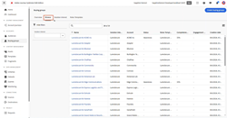

# [!DNL Journey Optimizer B2B Edition] 튜토리얼

[!DNL Journey Optimizer B2B Edition]을 최대로 활용하는 방법에 대해 알아봅니다. 기본 제공 생성형 AI와 업계 최고 수준의 자동화를 활용해 계정 및 구매 그룹 여정을 조율하여 특정 서비스에 대한 수요를 극대화할 수 있습니다.

## 새로운 기능 {#whats-new}

* [계정 여정 소개](/help/account-journeys/introducing-account-journeys.md)
  _계정 여정 및 이를 사용하여 대상 대상자를 참여시키는 방법에 대해 모두 알아봅니다._

* [계정 여정 만들기](/help/account-journeys/create-an-account-journey.md)
  _계정 대상, 작업 노드, 수신 대기 노드 및 경로 분할 노드를 사용하여 계정 여정을 만드는 방법을 알아봅니다._

* [작업 노드](/help/account-journeys/journey-nodes/action-node.md)
  _계정 여정을 만들 때 작업 노드 및 이를 구성하는 방법에 대해 알아봅니다._

* [수신 노드](/help/account-journeys/journey-nodes/listen-node.md)
  _계정 여정을 만들 때 수신 대기 노드와 수신 대기 노드를 구성하는 방법에 대해 알아봅니다._

* [계정 분할 여정](/help/account-journeys/journey-nodes/split-account-journey.md)
  _계정 여정을 만들 때 분할/병합 경로 노드 및 이를 구성하는 방법에 대해 알아봅니다._

## 가장 인기 있는 비디오 {#most-popular-videos}

<table>
<tr>
<td>

<a href="/help/buying-groups/buying-groups-overview.md"><strong>구매 그룹 개요</strong></a>

</td>
<td>

<a href="/help/buying-groups/create-a-buying-group.md"><strong>구매 그룹 만들기</strong></a>

</td>
<td>

<a href="/help/buying-groups/role-templates.md"><strong>역할 템플릿</strong></a>

</td>
</tr>
</table>
